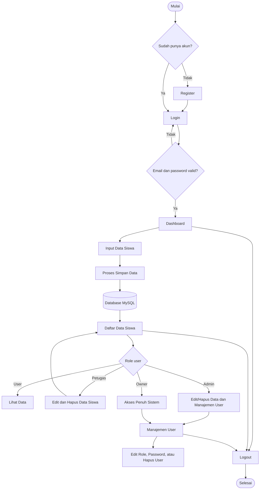

# Materi Presentasi FormSiswa

## Penjelasan Singkat Web

FormSiswa adalah aplikasi web sederhana untuk mengelola data siswa. Aplikasi ini dibuat menggunakan PHP native, MySQL, dan Tailwind CSS.

Tujuan aplikasi ini adalah membantu proses input, penyimpanan, dan pengelolaan data siswa secara digital.

Fitur utama aplikasi:

- Login dan register pengguna
- Input data siswa
- Menampilkan daftar data siswa
- Edit dan hapus data siswa
- Manajemen pengguna
- Hak akses berdasarkan role
- Menampilkan siapa user yang menginput data siswa

Role yang digunakan:

- `owner`
- `admin`
- `petugas`
- `user`

User biasa dapat login, input data, dan melihat data. Petugas, admin, dan owner dapat mengedit serta menghapus data siswa. Admin dan owner dapat mengelola data user.

## Teknologi yang Digunakan

Aplikasi ini menggunakan:

- PHP sebagai bahasa backend
- MySQL sebagai database
- PDO untuk koneksi dan query database
- Tailwind CSS untuk tampilan
- JavaScript untuk interaksi tampilan seperti validasi form, dropdown, dan modal

Jika ditanya CSS yang digunakan, jawab:

> Aplikasi ini menggunakan Tailwind CSS sebagai framework CSS utama. Styling dibuat dengan utility class langsung di file PHP. Selain itu ada sedikit custom CSS untuk font, efek glassmorphism, animasi validasi, dan modal.

## Alur Aplikasi

Alur aplikasi dimulai dari halaman login atau register. Jika user belum punya akun, user dapat melakukan register terlebih dahulu. Setelah login berhasil, user masuk ke dashboard.

Di dashboard, user dapat menginput data siswa. Data yang dikirim diproses oleh `datadiri_show.php`, lalu disimpan ke database MySQL pada tabel `data_siswa`. Setelah itu data dapat dilihat di halaman daftar siswa.

Hak akses fitur ditentukan berdasarkan role:

- `user`: input dan melihat data
- `petugas`: input, melihat, edit, dan hapus data siswa
- `admin`: mengelola data siswa dan user
- `owner`: akses penuh sistem

Kode Mermaid untuk diagram alur:



## Penjelasan Auto Setup

`auto_setup.php` adalah file bantu untuk menyiapkan database secara otomatis.

Fungsinya:

- Membuat tabel `users`
- Membuat tabel `data_siswa`
- Menambahkan kolom `email`
- Menambahkan kolom `created_by`
- Mengatur role user
- Membuat akun default

Akun default:

```text
owner@formsiswa.local / password123
admin@formsiswa.local / password123
petugas@formsiswa.local / password123
user@formsiswa.local / password123
```

Jawaban presentasi:

> Auto setup adalah file bantu untuk membuat atau memperbarui struktur database. File ini digunakan saat setup awal agar tabel, role, relasi, dan akun default langsung tersedia.

Catatan:

> File `auto_setup.php` sebaiknya hanya digunakan saat setup awal. Setelah database siap, file ini sebaiknya tidak dibuka sembarangan.

## Query yang Digunakan

Query login:

```sql
SELECT * FROM users WHERE email = ?
```

Digunakan untuk mencari akun berdasarkan email saat login.

Query register:

```sql
SELECT id FROM users WHERE username = ? OR email = ?
```

Digunakan untuk mengecek apakah username atau email sudah terdaftar.

```sql
INSERT INTO users (username, email, password, role)
VALUES (?, ?, ?, 'user')
```

Digunakan untuk menyimpan akun baru dengan role default `user`.

Query input data siswa:

```sql
INSERT INTO data_siswa
(nama, nis, tempat_lahir, tanggal_lahir, jenis_kelamin, agama, alamat, created_by)
VALUES (?, ?, ?, ?, ?, ?, ?, ?)
```

Digunakan untuk menyimpan data siswa baru.

Query menampilkan data siswa:

```sql
SELECT ds.*, u.username AS creator, u.role AS creator_role
FROM data_siswa ds
LEFT JOIN users u ON ds.created_by = u.id
ORDER BY ds.created_at DESC
```

Digunakan untuk menampilkan data siswa beserta nama dan role user yang menginput data.

Query edit data siswa:

```sql
SELECT * FROM data_siswa WHERE id = ?
```

```sql
UPDATE data_siswa
SET nama = ?, nis = ?, tempat_lahir = ?, tanggal_lahir = ?,
    jenis_kelamin = ?, agama = ?, alamat = ?
WHERE id = ?
```

Query hapus data siswa:

```sql
DELETE FROM data_siswa WHERE id = ?
```

Query manajemen user:

```sql
SELECT * FROM users ORDER BY username ASC
```

```sql
SELECT * FROM users WHERE id = ?
```

```sql
UPDATE users SET role = ? WHERE id = ?
```

```sql
UPDATE users SET password = ? WHERE id = ?
```

```sql
DELETE FROM users WHERE id = ?
```

## Tipe Data Database

Tipe data yang digunakan:

```text
INT
VARCHAR
TEXT
DATE
TIMESTAMP
ENUM
```

Penjelasan:

`INT` digunakan untuk angka, seperti `id` dan `created_by`.

```sql
id INT AUTO_INCREMENT PRIMARY KEY
created_by INT
```

`VARCHAR` digunakan untuk teks pendek dengan panjang terbatas.

```sql
username VARCHAR(50)
email VARCHAR(100)
password VARCHAR(255)
nama VARCHAR(100)
nis VARCHAR(20)
tempat_lahir VARCHAR(100)
jenis_kelamin VARCHAR(20)
agama VARCHAR(20)
```

`TEXT` digunakan untuk teks panjang, seperti alamat.

```sql
alamat TEXT
```

`DATE` digunakan untuk menyimpan tanggal.

```sql
tanggal_lahir DATE
```

`TIMESTAMP` digunakan untuk menyimpan waktu otomatis saat data dibuat.

```sql
created_at TIMESTAMP DEFAULT CURRENT_TIMESTAMP
```

`ENUM` digunakan untuk membatasi pilihan nilai tertentu.

```sql
role ENUM('owner', 'admin', 'petugas', 'user')
```

Jawaban singkat:

> Tipe data yang digunakan adalah INT untuk ID, VARCHAR untuk teks pendek, TEXT untuk alamat, DATE untuk tanggal lahir, TIMESTAMP untuk waktu input data, dan ENUM untuk role user.

## Bagian Program yang Menggunakan Percabangan

Program menggunakan percabangan `if`, `else`, dan `elseif`.

Contoh cek login:

```php
if (!isset($_SESSION['user_id'])) {
    header("Location: login.php");
    exit;
}
```

Penjelasan:

> Percabangan ini mengecek apakah user sudah login. Jika belum login, user diarahkan ke halaman login.

Contoh login berhasil atau gagal:

```php
if ($user && password_verify($password, $user['password'])) {
    $_SESSION['user_id'] = $user['id'];
    $_SESSION['username'] = $user['username'];
    $_SESSION['email'] = $user['email'];
    $_SESSION['role'] = $user['role'];

    header("Location: index.php");
    exit;
} else {
    $error = "Email atau password salah!";
}
```

Penjelasan:

> Jika email ditemukan dan password benar, user diarahkan ke dashboard. Jika salah, sistem menampilkan pesan error.

Contoh validasi register:

```php
if ($password !== $confirm_password) {
    $error = "Konfirmasi password tidak cocok!";
} elseif (!filter_var($email, FILTER_VALIDATE_EMAIL)) {
    $error = "Format email tidak valid!";
} else {
    // proses simpan akun
}
```

Penjelasan:

> Percabangan ini mengecek apakah password dan konfirmasi password sama, lalu mengecek format email. Jika valid, akun disimpan.

Contoh cek role:

```php
if (!isset($_SESSION['user_id']) || !in_array($_SESSION['role'], ['owner', 'admin'])) {
    header("Location: index.php");
    exit;
}
```

Penjelasan:

> Percabangan ini membatasi akses halaman manajemen user. Hanya owner dan admin yang boleh membuka halaman tersebut.

Contoh menampilkan menu berdasarkan role:

```php
<?php if (in_array($_SESSION['role'], ['owner', 'admin'])): ?>
    <a href="manage_users.php">Users</a>
<?php endif; ?>
```

Penjelasan:

> Menu Users hanya ditampilkan untuk owner dan admin.

Jawaban singkat:

> Percabangan digunakan untuk mengecek login, validasi register, menentukan login berhasil atau gagal, membatasi akses berdasarkan role, menampilkan menu sesuai role, dan mencegah user mengakses fitur yang bukan haknya.

## Langkah Menyisipkan Template Form Login dan Register

Langkah-langkah yang dilakukan:

1. Membuat file `login.php` dan `register.php`.

2. Menghubungkan file dengan database.

```php
session_start();
require 'config.php';
```

3. Membuat struktur HTML dasar.

4. Menghubungkan file CSS.

```html
<link rel="stylesheet" href="dist/output.css">
```

5. Menyisipkan template form login.

Form login berisi:

- Email
- Password
- Tombol masuk
- Link ke register

6. Memberi atribut `name` pada input login.

```html
<input type="email" name="email">
<input type="password" name="password">
```

7. Menambahkan proses login.

```php
$email = $_POST['email'] ?? '';
$password = $_POST['password'] ?? '';
```

8. Mengecek email ke database.

```sql
SELECT * FROM users WHERE email = ?
```

9. Memverifikasi password.

```php
password_verify($password, $user['password']);
```

10. Mengarahkan user ke dashboard jika login berhasil.

```php
header("Location: index.php");
exit;
```

11. Menyisipkan template form register.

Form register berisi:

- Username
- Email
- Password
- Konfirmasi password
- Tombol daftar
- Link ke login

12. Memberi atribut `name` pada input register.

```html
<input type="text" name="username">
<input type="email" name="email">
<input type="password" name="password">
<input type="password" name="confirm_password">
```

13. Menambahkan validasi register.

Validasi yang dilakukan:

- Password dan konfirmasi password harus sama
- Format email harus valid
- Username atau email tidak boleh sudah terdaftar

14. Mengecek data ke database.

```sql
SELECT id FROM users WHERE username = ? OR email = ?
```

15. Melakukan hash password.

```php
password_hash($password, PASSWORD_DEFAULT);
```

16. Menyimpan akun baru ke database.

```sql
INSERT INTO users (username, email, password, role)
VALUES (?, ?, ?, 'user')
```

17. Menguji alur login dan register.

Pengujian yang dilakukan:

- Register akun baru
- Login menggunakan email dan password
- Masuk ke dashboard
- Logout
- Login kembali

Jawaban singkat:

> Langkahnya dimulai dari membuat file login dan register, menghubungkan database, menyisipkan template HTML form, memberi input email dan password, menambahkan validasi, mengecek data ke database, menyimpan password dengan hash, lalu mengarahkan user ke dashboard jika login berhasil.

## Kesimpulan

FormSiswa adalah aplikasi CRUD data siswa berbasis web. Aplikasi ini memiliki fitur login, register, input data siswa, daftar data siswa, edit dan hapus data, serta manajemen user.

Aplikasi ini menggunakan role untuk membatasi hak akses. Database menggunakan tabel `users` dan `data_siswa`. Query database dijalankan menggunakan PDO prepared statement agar lebih aman.
